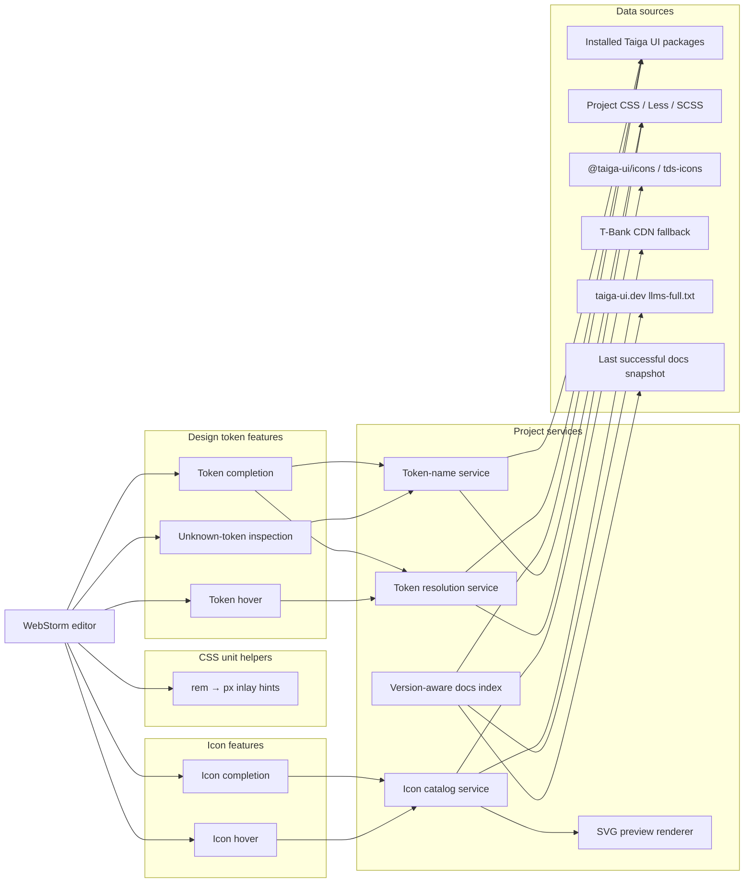
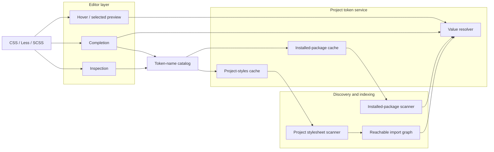
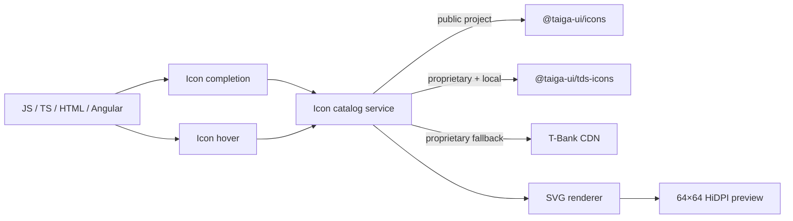
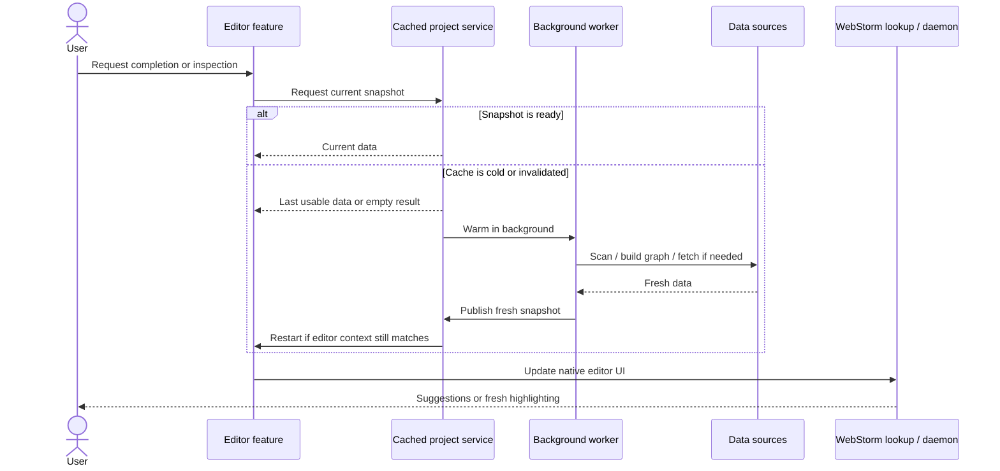

# Architecture

This document is the architectural contract for the Taiga UI Companion plugin.

Keep `README.md` focused on product capabilities. Changes that introduce a new subsystem, data source, cache boundary, or dependency between architectural layers should update this document in the same pull request.

## Architecture overview

The plugin has independent project-data pipelines for design tokens, icons, and Taiga UI documentation, plus lightweight editor-only helpers for CSS units. Editor features consume project-level services only when they need discovery or cached project data; stateless transformations stay at the editor layer. Installed project packages remain authoritative for API availability and source-changing actions; remote documentation is enrichment only.



## Design token subsystem

Token names and token values intentionally have different reachability rules.

Completion and inspection need a broad catalog of known names. Hover and selected-item preview need the stricter reachable declaration graph to determine effective values.



The broad token-name catalog must not change value-resolution semantics. A token can be known to completion and inspection while still being unreachable for effective-value resolution from the current source context.

### Installed package graph

The installed-package scanner starts from the nearest `node_modules/@taiga-ui` scope for the source file. It resolves installed Taiga UI packages and follows style imports to preserve package precedence and override behavior.

When `@taiga-ui/proprietary` is installed, the value-resolution graph keeps its reachability rules: declarations in unrelated Taiga UI package files do not become active merely because they exist somewhere under `node_modules`.

The broader token-name catalog used by completion and inspection is separate and may scan additional public style roots for known names without changing effective-value semantics.

### Project stylesheet graph

Project stylesheet discovery starts from the current source file and configured style entrypoints, then follows local CSS/Less/SCSS imports.

Reachable project declarations are indexed as an application layer over installed package declarations.

The project cache is separate from the installed-package cache because these layers have different invalidation rates and resolution semantics.

### Resolution model

Project overrides are evaluated as an application layer before installed package candidates.

The resolver keeps deterministic order only where the source graph proves it. Conflicting candidates remain ambiguous instead of inventing an order.

Recursive `var(...)` references use the same context-aware candidate selection model, with cycle protection and grouped source information preserved for editor presentation.

## Taiga UI documentation subsystem

The documentation subsystem provides a structured, version-aware enrichment index for native IDE documentation and discovery features.

The current source model is:

1. detect the nearest installed Taiga UI package scope for the source file;
2. prefer `@taiga-ui/core` as the project version source and derive the installed major version from local `package.json`;
3. map supported majors to the official documentation source:
    - Taiga UI 4 → `https://taiga-ui.dev/v4/llms-full.txt`;
    - Taiga UI 5 → `https://taiga-ui.dev/llms-full.txt`;
4. parse the import map and entity sections into an immutable index;
5. expose lookup by public symbol, selector, and documentation section ID where the source provides enough metadata.

Unsupported future majors do not fall back to the current documentation implicitly. A new source mapping must be added deliberately after its compatibility is known.

### Authority and enrichment

Installed project packages are the source of truth for:

- whether a Taiga UI package is installed in the current project context;
- actual public exports and API availability;
- safe import rewrites, inspections, migrations, and other source-changing actions;
- types whenever installed declarations/Angular metadata can provide them.

Official documentation can enrich that local truth with descriptions, examples, API explanations, documentation links, and migration guidance. Remote documentation must never make a missing local API appear available or authorize a destructive/source-changing fix by itself.

The docs snapshot therefore filters parsed entities against packages installed in the resolved local package scope and excludes entities introduced after the locally installed Taiga UI version. Angular template cards intersect documented inputs/outputs with the installed Angular-resolved API; remote descriptions may enrich matching properties but cannot add missing bindings or replace installed types.

### Loading and cache lifecycle

Documentation network access, package discovery, disk cache IO, and parsing run off the EDT.

The project-level docs store:

- keeps immutable in-memory indexes keyed by versioned documentation source;
- coalesces concurrent cold loads and concurrent refreshes for the same source;
- persists only successfully parsed remote content as the last-known-good disk snapshot;
- can serve that disk snapshot offline;
- keeps the last usable snapshot when refresh returns empty, malformed, or fails;
- performs a background refresh after publishing a disk-cached snapshot;
- uses a generation guard so invalidated work cannot publish stale results;
- supports targeted invalidation per documented Taiga major.

Cache bookkeeping stays behind small synchronized sections; network requests and parsing remain outside cache locks.

### Contextual documentation cards

Hover cards share a header, semantic kind badge, package metadata, and working documentation/source actions. Their bodies are specific to components, directives, pipes, and individual bindings. Parameters are visible immediately; complete examples are opened explicitly. Current application markup and canonical imports do not occupy the hover summary.

Locally resolved declarations contribute bounded, immutable presentation facts: source location, Angular selector, signal-input types, literal or injected input defaults, and a pipe's transform signature. Purity is shown only when local `@Pipe`/`definePipe` metadata establishes it. The standalone argument of `PipeDeclaration` is never interpreted as purity. Unknown defaults and dynamic expressions remain unknown; no JavaScript is evaluated.

`Angular2ApplicableDirectivesProvider` and `Angular2DeclarationsScope` determine the element's matching directives in its component import scope. `Angular2Directive.inputs/outputs` provide public aliases, inherited members, required flags and exposed host-directive aliases. Each binding records every receiver, including local application directives alongside Taiga; declaration locations refer to the actual declaring field/class. Signal write types and transform parameter types describe accepted template values separately from stored value types. Extraction is bounded to 32 matched directives and 128 API members per directive; incomplete snapshots cannot authorize edits. Installed API snapshots can render immediately without a remote docs index.

Angular template pipes are resolved through host/injected PSI references into installed Taiga packages before documentation enrichment. This covers external and inline templates. Pipe resolution uses incomplete-code candidates, preserving Angular's declaration scope before argument/overload validation, so unfinished bindings can still show the known pipe API. Ordinary pipes and unrelated local symbols remain owned by the IDE. Hover captures the pointer and document generation on EDT, then resolves PSI in a background read action; cancelled or stale candidates cannot publish a card.

Pinned cards retain their immutable documentation snapshot and ignore ordinary editor mouse dismissal. Explicit close, Escape, editor release, and project disposal end their lifetime; unpinning a stale snapshot dismisses it. Native hover suppression is restored while pinned. Pinning introduces no background discovery work.

Source-changing actions carry a context captured in the background read action: the host document stamp, project root generation, a bounded local import graph rooted at the template and its component, installed package roots reached by that graph, and ancestor configuration/lockfile paths. Explicit installed source dependencies can extend that context. Unsaved or uncommitted documents invalidate it only when they belong to these dependencies. A truncated graph retains a conservative project boundary. Checks immediately before and inside each write remain cheap; listeners only record relevant VFS changes and schedule stale-state presentation. Unrelated project edits keep a card usable. Navigation and literal copying remain available while value, required-input, deprecated-binding and icon writes are blocked.

Refresh uses a disposable marker around the opening tag to find the original binding after unrelated edits or an action's rename. It resolves the installed API in a cancellable background read action with committed documents and smart-mode indexes, and re-detects the current installed package context before enrichment. It replaces adapters only after a current result is available. Presentation views and navigation history are rebound to the newly resolved installed subjects and API members; removed members/receivers are dropped instead of retaining an editable stale snapshot. API queries, selected rows, viewport positions and pinned popup geometry survive replacement; failed/deleted targets keep actions blocked. Successful value/template writes trigger this refresh; Undo/Redo invalidate the prior snapshot. Closing the popup or releasing its editor disposes the refresh marker.

The `TaigaUI.ShowDocumentationCard` action opens the same interactive Swing card at the caret, independently of mouse-hover settings, without the hover delay. It is available in Find Action and the editor context menu with Alt+Shift+Q. Explicit cards request focus on the first action; all buttons and links support Enter, links support Space, focus traversal stays within the card, Escape closes it, and F5 refreshes. Literal choices have separate keyboard-accessible Apply and Copy buttons; larger sets expose searchable full choices. Rebuilt choices retain stale-context write blocking. Explicit requests show a cancellable loading/indexing popup and an unavailable-target state. Refresh shows progress inside the existing card. Automatic refresh after required-input insertion does not request card focus and explicitly returns focus to the host editor. Icon preview loading and guarded chooser writes live in `TaigaDocumentationIcons`. `TaigaDocumentationCardEditors` owns and disposes binding/tag adapters for the captured action context; `TaigaDocumentationStatusPopup` owns the temporary loading/unavailable popup. The hover controller owns installed-card lifetime and request validity. Native Quick Documentation remains an informational HTML surface. Type/import/example copying and description expansion operate only on immutable presentation text. Import assistance delegates to the platform ShowIntentionActions action at the tracked host offset, allowing native Angular intentions to own import candidates and component/module scope updates; it performs no independent package discovery or import rewrite.

Input value actions require an existing static input, a complete finite string union resolved from installed declarations, and an unchanged binding. Documentation-only values never authorize source edits. Binding snapshots and their locally resolved input declarations are captured under the resolver's background read action (bounded to 32 existing attributes per entity card); an editor adapter tracks the attribute with a disposable range marker, checks its exact text inside one named write command, and commits the document. Unrelated edits can move the marker; changed bindings, tag names, and Taiga selector names are rejected. Dynamic expressions are never evaluated or replaced. Local type alias resolution is bounded and uses existing PSI references. Native input symbols also project complete typed field declarations to their public binding names, covering ordinary fields and aliases; this projection never evaluates initializers.

For shared bindings, editable literal choices are the intersection of complete finite types from all receivers; any unknown receiver type disables writes. Required-input actions insert an empty binding on the existing opening tag and place the caret inside it. Deprecated-input renaming requires explicit local `@deprecated` replacement guidance, the replacement's public Angular alias, equal accepted types, and agreement from every receiver. It changes only the attribute name, preserving dynamic expressions. Both actions verify the bounded opening-tag snapshot through disposable range markers inside one named write command and support Undo. Read-only documents, duplicate bindings, stale tags, and two-way deprecated bindings are rejected. Injected template locations are mapped back to host offsets; source edits require exact host-text matches.

The full-API browser searches immutable inputs/outputs by name, type and description without PSI, package discovery or network work on keystrokes. Member/owner navigation maintains popup history and restores search queries; native list keys, Enter, Ctrl/Cmd+F and Alt+Left support keyboard exploration. Each receiver links to its owner API and declaring source. Navigation preserves existing editor adapters until their context changes, and explicit dismissal disposes markers and history.

The documentation UI may consume the existing icon catalog and renderer through an editor-level adapter. It introduces no independent icon discovery or source precedence. SVG loading/rendering runs separately on IO workers, so documentation can appear before a preview is ready. Late results are applied only to the still-current card and document.

The icon chooser replaces only an already-present, complete static `@tui.*` literal or an empty string literal, in one undoable write command. It checks the document generation and original literal before writing, including zero-length ranges inside empty quotes. Empty values offer choosing without an invented preview. Dynamic bindings are never evaluated or overwritten by the chooser.

The explicit loading/unavailable status popup captures a disposable host-document range marker for its initial caret target. Angular quick fixes uses that tracked position even if the caret moves or preceding text changes. Closing/replacing the status popup or releasing the editor disposes the marker; a deleted target cannot dispatch native intentions at a neighboring element.

## CSS unit helpers

CSS unit helpers are intentionally stateless editor features. They do not participate in token discovery, project graphs, caches, or package resolution.

The `rem` inlay feature:

- runs for standalone CSS, Less, and SCSS files and for stylesheet PSI injected into JavaScript/TypeScript hosts such as Angular component `styles` template literals;
- uses one CSS-language registration for CSS dialects, avoiding duplicate hints in Less/SCSS where those languages inherit from CSS;
- maps injected stylesheet offsets back to the host editor before placing inlays;
- recognizes literal `rem` dimensions in stylesheet source text;
- converts literals with the fixed browser-default assumption `1rem = 16px`;
- ignores matching text inside comments and strings;
- groups multiple `rem` values from the same declaration line into one hint;
- renders through IntelliJ's declarative inlay-hints API after the declaration semicolon, using text-without-background presentation and without changing file contents.

Future local unit conversions should stay in this subsystem unless they require project-specific configuration or discovery.

## Icon subsystem

Icon completion and icon hover share one catalog service and one SVG renderer.

Public and proprietary catalogs are mutually exclusive. The CDN is only a proprietary fallback when local `tds-icons` is unavailable.



Current source precedence is part of the product contract:

1. public project → installed `@taiga-ui/icons`;
2. proprietary project with installed `@taiga-ui/tds-icons` → local proprietary icons;
3. proprietary project without local `tds-icons` → T-Bank CDN fallback.

The icon subsystem is independent from the token-resolution graph.

## Background loading and caching

Completion and inspection must not perform expensive discovery on the UI path.

Token and icon services follow the same cold-cache pattern: return an already usable snapshot when possible, warm missing data in the background, and restart the editor feature only if its context is still valid.



### Cache and threading rules

- Cache monitors protect cache bookkeeping only.
- Expensive graph construction, filesystem scanning, PSI extraction, network requests, SVG loading, and rendering stay outside synchronized sections.
- Cold completion warming and selected-item resolution run off the UI thread.
- Token completion may reuse a stale-but-valid name snapshot while a refresh is in progress.
- Unknown-token inspection requires a fresh strict snapshot before reporting warnings.
- Rebuilds are lazy after invalidation.
- Concurrent cache misses for the same logical source should be coalesced rather than performing duplicate work.

### Performance diagnostics

Performance diagnostics are an opt-in, telemetry-free cross-cutting helper. They are disabled by default and do not change cache, resolution, or icon-source behavior.

When the `taiga.design.tokens.performanceDiagnostics` JVM system property is enabled, the plugin records call counts and elapsed time for package scanning, project graph building, PSI extraction, index composition, value resolution, and icon catalog loading. Measurements stay in process and are also written to the IDE log for before/after comparisons.

The diagnostics package contains no token or icon domain state. Token, PSI, project, and icon code may report measurements to it without introducing dependencies between the token and icon subsystems.

## Package boundaries

```text
org.taigaui.designtokens
├── diagnostics    opt-in telemetry-free performance measurements shared by independent subsystems
├── index          immutable declaration/index contracts
├── packageinfo    installed package discovery and style scanning
├── resolution     var() parsing, candidate selection, recursive resolution, and grouping
├── psi            IntelliJ CSS/SCSS/Less PSI adapter
├── project        package/project graph orchestration, caches, invalidation, and resolution entry point
├── completion     token completion, strict inspection names, native lookup integration, and selected-item preview
├── units          stateless CSS unit parsing, conversion, injected-style mapping, and declarative inlay presentation
├── icons          @tui.* completion, local/remote catalogs, SVG preview rendering, and icon hover
└── documentation  token-reference scanning, hover controller, Swing model, and Swing popup
```

Dependencies point inward:

- `completion` consumes the project-level token service;
- `documentation` contains both the independent Taiga docs enrichment pipeline and token-hover UI that consumes the token service;
- `project` orchestrates `packageinfo`, `index`, `resolution`, and `psi`;
- `resolution` depends on immutable contracts from `index`;
- `psi` adapts IntelliJ Platform syntax trees into index declarations;
- `units` stays independent from project-data services and contains only local editor transformations;
- `icons` does not depend on the token-resolution graph;
- `diagnostics` contains no domain state and can be used by independent subsystems without coupling them together.

## Architectural rules

When extending the plugin:

- keep token, icon, and remote documentation domain models separate;
- keep installed package metadata authoritative over remote documentation for API availability and source-changing actions;
- prefer immutable indexes/snapshots at service boundaries;
- keep IntelliJ UI integration at the outer layer;
- keep stateless local editor transformations out of project-data services;
- keep expensive work off EDT;
- preserve the distinction between broad token-name discovery and strict effective-value resolution;
- prefer precise invalidation over global refreshes;
- do not introduce a generic abstraction unless at least two concrete subsystems clearly benefit from it;
- preserve current resolution semantics and icon source precedence unless a product change explicitly requires otherwise.

## Related documents

- [`roadmap.md`](roadmap.md) — implementation roadmap and remaining production work;
- [`local-debugging.md`](local-debugging.md) — local sandbox, debugger, logs, and real-project testing.
